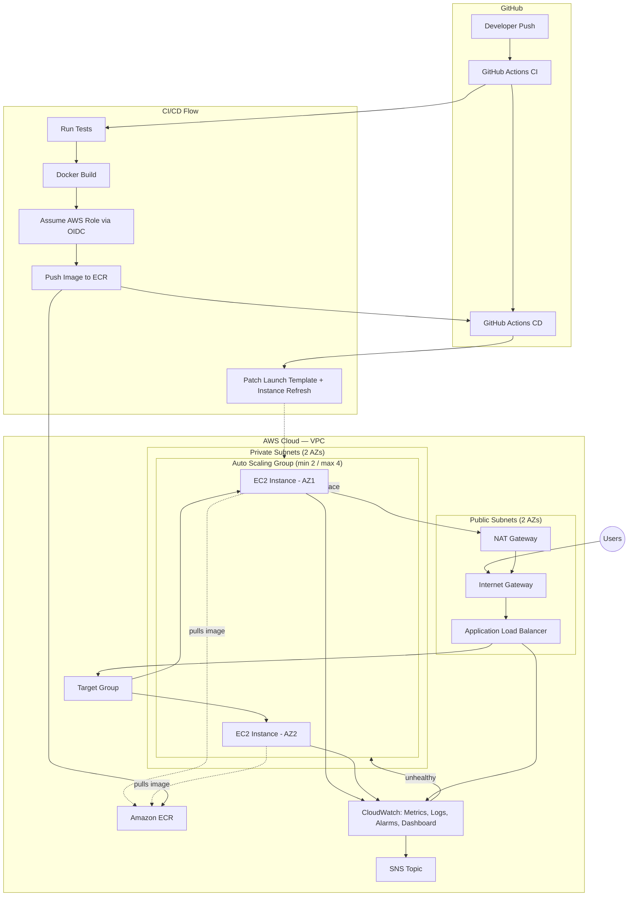

# Architecture

## Diagram

## Component Responsibilities

*(See README §5 for the summary table; below is the detailed reasoning
behind each choice, consolidated from the phase-by-phase build.)*

### Networking (Phase 3)

Two Availability Zones, public + private subnet pairs in each. Public
subnets host only the ALB and the NAT Gateway — nothing with application
logic is ever internet-facing. A single shared NAT Gateway is the default
(cost trade-off, documented below); toggling `single_nat_gateway = false`
gives one NAT Gateway per AZ for full HA.

### Security Groups (Phase 4)

The ALB security group accepts inbound HTTP/HTTPS from `0.0.0.0/0`. The EC2
security group accepts inbound traffic on the app port **only from the ALB
security group** — a security-group reference, not a CIDR block, meaning the
rule stays correct even if the ALB's underlying IPs change. No SSH ingress
rule exists anywhere; shell access is via SSM Session Manager, which requires
no inbound port.

### Compute (Phase 7)

Each EC2 instance boots from a Launch Template using the latest Amazon Linux
2023 AMI (resolved dynamically, never a hardcoded/stale AMI ID), attaches an
IAM instance role (ECR pull scoped to one repo, SSM, CloudWatch — no static
credentials), and runs a bootstrap script via user-data that installs
Docker, authenticates to ECR using the instance role, and starts the
container with its logs shipped to CloudWatch. IMDSv2 is enforced.

### Load Balancing & Health (Phase 6, 8)

The ALB health-checks `GET /health` every 15 seconds; 2 consecutive passes
mark a target healthy, 2 consecutive failures mark it unhealthy. Critically,
the Auto Scaling Group's `health_check_type` is set to `ELB`, not the AWS
default `EC2` — meaning the ASG's replacement decisions are driven by
whether the *application* is actually responding correctly, not merely
whether the underlying EC2 hardware is alive. This is the entire self-healing
mechanism in one setting.

### Scaling (Phase 8)

Min 2 / desired 2 / max 4, with a target-tracking policy holding average CPU
near 60%. AWS manages the underlying scaling alarms automatically.

### Monitoring (Phase 9) {#monitoring-design}

| Alarm | Metric | Threshold | Why |
|---|---|---|---|
| ALB 5xx | `HTTPCode_Target_5XX_Count` | Sum > 10 / 60s, 2 periods | Application-level errors on requests it *did* receive |
| Unhealthy targets | `UnHealthyHostCount` | > 0, 2 periods | Earliest visible sign self-healing is (or will be) triggered |
| High CPU | `CPUUtilization` (ASG) | > 80%, 3 periods | Visibility into sustained load, independent of the scaling policy's own internal alarm |
| Low in-service count | `GroupInServiceInstances` | < 2, 2 periods | The alarm that should worry you most — the ASG isn't maintaining minimum capacity |

Logs ship via Docker's `awslogs` driver directly to CloudWatch Logs — no
separate CloudWatch Agent process, since the IAM instance role already has
the needed permissions and gunicorn already logs to stdout.

### CI/CD Authentication (Phase 11, 12) {#security-tradeoffs}

GitHub Actions authenticates to AWS via OIDC federation: GitHub issues a
short-lived JWT scoped to the specific workflow run, AWS STS validates it
against a registered OIDC provider and a trust policy condition pinning the
`sub` claim to `repo:<org>/<repo>:ref:refs/heads/main`, and issues temporary
credentials (1-hour max) scoped to exactly two IAM roles' worth of
permissions — one for ECR push, one for Launch Template/ASG modification.
No AWS access key has ever existed in this project's GitHub configuration.

### Intentional Security Simplifications

- **HTTP-only by default.** The ALB module supports HTTPS (`enable_https`,
  ACM certificate ARN) but it's off by default since enabling it requires a
  real registered domain and issued certificate — outside this project's
  default scope, but the Terraform structure is ready.
- **Egress left open** on both security groups. Locking egress down to
  specific AWS service endpoints (ECR, S3, CloudWatch, SSM) is a legitimate
  further-hardening step not implemented here, to keep the security-group
  design comprehensible for a learning project.
- **No WAF.** Out of scope for the core learning goals of this project.

## Deployment Strategy

Images are tagged `sha-<7-char-git-sha>`, never `latest`, enforced by ECR's
`IMMUTABLE` tag policy. The GitHub Actions CD workflow patches the exact tag
into the Launch Template's user-data via direct AWS CLI calls (not
`terraform apply`, to decouple app deployment from infrastructure changes),
triggers a rolling Instance Refresh (`MinHealthyPercentage: 50`), and
verifies the deployment by polling the live `/version` endpoint — not just
trusting that the Instance Refresh API reported success. A failed
verification automatically triggers a rollback job that reverts the Launch
Template to its previous version and re-triggers an Instance Refresh.
